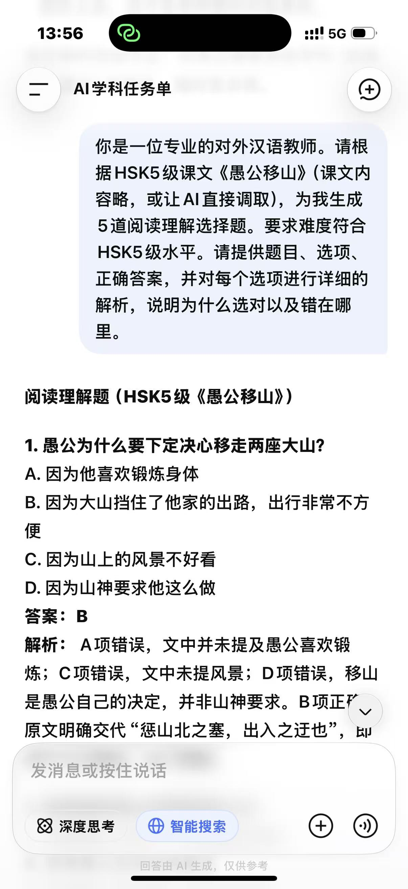
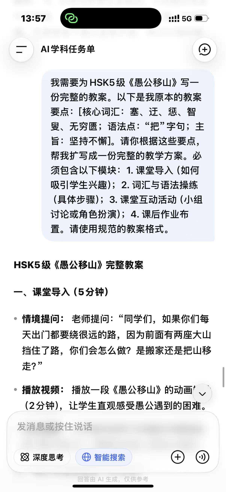
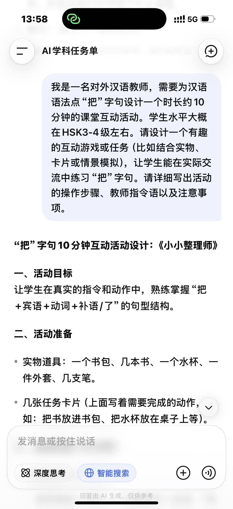

#与AI的对话截图

#任务单
任务①：出题
阅读理解题（HSK5级《愚公移山》）

1. 愚公为什么要下定决心移走两座大山？
A. 因为他喜欢锻炼身体
B. 因为大山挡住了他家的出路，出行非常不方便
C. 因为山上的风景不好看
D. 因为山神要求他这么做
答案：B
解析： A项错误，文中并未提及愚公喜欢锻炼；C项错误，文中未提风景；D项错误，移山是愚公自己的决定，并非山神要求。B项正确，原文明确交代“惩山北之塞，出入之迂也”，即苦于大山阻挡，出门绕路。

2. 智叟嘲笑愚公的原因是什么？
A. 觉得愚公太老了，根本搬不动山
B. 觉得愚公应该去城里住
C. 觉得愚公应该把山卖给开发商
D. 觉得愚公不应该带着孩子干活
答案：A
解析： B、C、D项均为无中生有。A项正确，智叟认为愚公“残年余力，曾不能毁山之一毛”，即年老力衰，连山上的一棵草都拔不掉，不可能移走大山。

3. 愚公是如何反驳智叟的？
A. 他说自己有很多钱，可以雇人搬山
B. 他说子子孙孙无穷无尽，而山不会增高，总有一天能搬完
C. 他说自己会法术，可以瞬间移山
D. 他说智叟是个笨蛋，不想跟他说话
答案：B
解析： A、C项与原文不符；D项虽然是态度问题，但不是反驳的核心内容。B项正确，愚公说“子子孙孙无穷匮也，而山不加增，何苦而不平”，这是他用发展的眼光看问题，认为人力无穷。

4. 最终两座大山是怎么被移走的？
A. 愚公一家人用手挖走的
B. 智叟被感动后帮忙移走的
C. 天帝被愚公的决心感动，派神仙把山背走了
D. 山自己塌了
答案：C
解析： A项错误，愚公一家虽然挖山，但时间有限，并未挖完；B项错误，智叟并未帮忙；D项错误，山没有自己塌。C项正确，原文结尾“帝感其诚，命夸娥氏二子负二山”，是神话色彩的结局。

5. 这个故事告诉我们什么道理？
A. 遇到困难要懂得放弃，不要做无用功
B. 只要有恒心和毅力，坚持不懈，就能克服看似不可能的困难
C. 搬家比移山容易，遇到问题要换个思路
D. 只有神仙才能解决大问题
答案：B
解析： A、D项与故事主旨相反；C项虽然现实中有道理，但不是《愚公移山》的寓意。B项正确，文章赞颂了愚公坚韧不拔、持之以恒的精神。
 
任务②：备课
HSK5级《愚公移山》完整教案

一、课堂导入（5分钟）
· 情境提问： 老师提问：“同学们，如果你们每天出门都要绕很远的路，因为前面有两座大山挡住了路，你们会怎么做？是搬家还是把山移走？”
· 播放视频： 播放一段《愚公移山》的动画短片（2分钟），让学生直观感受愚公遇到的困难。
· 引出课题： 今天我们来学习中国古代寓言故事《愚公移山》，看看这位老人是怎么做的。

二、词汇与语法操练（15分钟）
· 核心词汇讲解：
  · 塞（sāi）： 堵塞。例句：路被石头塞住了。
  · 迂（yū）： 绕远。例句：这条路太迂了，我们走另一条吧。
  · 惩（chéng）： 苦于。例句：他惩于交通不便，决定买车。
  · 智叟（zhì sǒu）： 聪明的老头（文中含讽刺意）。
  · 无穷匮（wú qióng kuì）： 没有穷尽。例句：知识是无穷匮的。
· 语法点“把”字句操练：
  · 句型展示： 愚公把山上的石头运到海里。
  · 机械操练： 老师给出图片（如：搬石头、挖土），学生用“把”字句描述。
  · 情景替换： 如果我们要把教室打扫干净，应该怎么做？（学生：把桌子擦干净、把地扫干净等）。

三、课堂互动活动（15分钟）
· 小组辩论（8分钟）： 将学生分为两组，一组支持“愚公移山”，一组支持“愚公搬家”。用中文进行简单辩论，要求必须使用至少一次“把”字句和本课新词。
· 角色扮演（7分钟）： 请两位学生分别扮演愚公和智叟，朗读并演绎两人对话的场景，注意语气和表情。其他同学点评。
四、课后作业布置（5分钟）
1. 书面作业： 用“把”字句造5个句子，描述你平时做家务的过程。
2. 口头作业： 把这个故事讲给你的朋友或家人听，并告诉他们你学到了什么道理。
3. 预习： 预习下一课的生词。
 
任务③：设计
“把”字句10分钟互动活动设计：《小小整理师》

一、活动目标
让学生在真实的指令和动作中，熟练掌握“把+宾语+动词+补语/了”的句型结构。

二、活动准备
· 实物道具：一个书包、几本书、一个水杯、一件外套、几支笔。
· 几张任务卡片（上面写着需要完成的动作，如：把书放进书包、把水杯放在桌子上等）。

三、活动步骤（10分钟）
1. 示范阶段（2分钟）：
   · 老师拿起一本书，一边做动作一边说：“我把书放进书包里了。”
   · 然后老师给出指令：“请把水杯拿起来。”请一位学生上台做动作，做完后要求学生用“把”字句汇报：“我把水杯拿起来了。”
2. 双人合作阶段（4分钟）：
   · 学生两人一组。A同学抽取一张任务卡片（例如：把外套挂在椅子上），但不能给B看。
   · A同学用“把”字句向B下达指令。
   · B同学执行动作，完成后必须说：“我把外套挂在椅子上了。”
   · 交换角色，继续练习。
3. 竞赛挑战阶段（4分钟）：
   · 老师快速说出指令（如：“请把三支笔放进书包里”），全班学生一起做动作。
   · 做得最快且能准确复述“我把三支笔放进书包里了”的小组得分。
   · 最后得分最高的小组获得“整理小能手”称号。

四、教师指令语示例
· “请大家看老师，老师现在要把书放在桌子上。”
· “A同学，请你告诉B同学，把窗户打开。”
· “做完动作后，一定要大声说出你刚才做了什么，用‘把’字句哦！”

五、注意事项
· 纠错重点： 学生容易漏掉“了”或放错动词位置。如果学生说“我把书放书包”，老师要引导：“书已经放好了，我们应该说‘我把书放进书包里了’。”
· 安全提示： 避免使用易碎物品（如玻璃杯），防止在活动中打碎。
· 全员参与： 确保每个学生都有下指令和执行指令的机会，不要只让活跃的学生参与。
